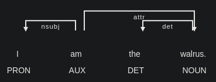

The purpose of this tutorial is to provide an overview of options for syntactic
parsing using Python packages.  
Two types of syntactic parsing are covered: constituency and dependency parsing.  
The packages covered are Stanza and spaCy; no direct constituency parser is
available for the latter, though, so constituent\_treelib is covered.

The versions used at the time of writing are:

stanza==1.10.1  
spacy==3.8.5  
constituent\_treelib==0.0.8

# Stanza

Start, of course, by loading in the package---notably the Pipeline class that
we'll be using. Needless to say, we could load the entire package, but that
will include unnecessary stuff.


```python
from stanza import Pipeline
```

## Stanza Basics

We'll need to instantiate a `Pipeline` for the language(s) we're working
with (here, English).
When created, the `Pipeline` may also be specified to load a variety of
processors that that are geared to particular tasks (such as syntactic
parsing).

If the `processors` argument is unspecified, all processors will be loaded.
It should be noted that the processors don't come with Stanza by default,
so all needed processors will also download if they haven't been yet.
To avoid (down)loading unnecessary/unneeded processors, it's best to
specify them when instatiating the `Pipeline`; the required processors are
listed below.

## Stanza Constituency Parsing

The processors that are needed for constituency parsing are:

- tokenize: In addition to tokenizing words, separates a document into sentences.
- mwt: "Mulit-word tokens"; splits tokens that contain multiple items into distinct tokens. Requires tokenize. This is also loaded automatically along with the "en" lang, whether or not it is inlcuded in the `processors` argument.
- pos: Part-of-speech tagging. Requires tokenize, mwt.
- constituency: Parses constituent structures.

The `Pipeline` instatiation for constituency parsing is below.
I've also set `logging_level` in order to avoid being inundated with info
about loading the processors, but it's probably best to keep that output while
playing around.


```python
nlp = Pipeline(
    lang = "en",
    processors = "pos,mwt,tokenize,constituency",
    logging_level = "WARN"
)
```

The pipeline itself then accepts the document to be processed, returning a
`Document` which contains a host of annotation data thereof,
depending on the processors being used.


```python
doc = nlp("I am the walrus.")
print(doc.text)
```

    I am the walrus.


Of particular interest for our purposes is the `.sentences` property, which
contains a list of `Sentence`s, which in turn are lists of `Word`s, containing
details about that particular word.


```python
print(doc.sentences)
```

    [[
      {
        "id": 1,
        "text": "I",
        "upos": "PRON",
        "xpos": "PRP",
        "feats": "Case=Nom|Number=Sing|Person=1|PronType=Prs",
        "start_char": 0,
        "end_char": 1
      },
      {
        "id": 2,
        "text": "am",
        "upos": "AUX",
        "xpos": "VBP",
        "feats": "Mood=Ind|Number=Sing|Person=1|Tense=Pres|VerbForm=Fin",
        "start_char": 2,
        "end_char": 4
      },
      {
        "id": 3,
        "text": "the",
        "upos": "DET",
        "xpos": "DT",
        "feats": "Definite=Def|PronType=Art",
        "start_char": 5,
        "end_char": 8
      },
      {
        "id": 4,
        "text": "walrus",
        "upos": "NOUN",
        "xpos": "NN",
        "feats": "Number=Sing",
        "start_char": 9,
        "end_char": 15,
        "misc": "SpaceAfter=No"
      },
      {
        "id": 5,
        "text": ".",
        "upos": "PUNCT",
        "xpos": ".",
        "start_char": 15,
        "end_char": 16,
        "misc": "SpaceAfter=No"
      }
    ]]


While not in the output above, the actual consituency parse of each sentence
is in the `constituency` property of the `Sentence`. The constituency object is
of the class `ParseTree`.

`ParseTree` has properties for `label` and `children`:

- The `label` property can be thought of as a node label, in the sense of
constituent phrase structure.

- The `children` property is a collection of further `ParseTree`s. In the case
of terminal nodes, `children` is an empty tuple.

Thus each object within the constituency structure
prepresents a constituent of the sentence.


```python
# Displaying the constituency structure
sentence = doc.sentences[0]
print(sentence.constituency)
```

    (ROOT (S (NP (PRP I)) (VP (VBP am) (NP (DT the) (NN walrus))) (. .)))


Note, too, that the top-most level is labeled as ROOT, which has S 'sentence'
as a child, although the child of ROOT may be whatever phrase is represented in
the document; e.g. below, it is NP:


```python
# Structure of a non-sentence doc
print(nlp("the eggman").sentences[0].constituency)
```

    (ROOT (NP (DT the) (NN eggman)))


## Additional Notes

### Branching structure

It is noteworthy that `children, being a `tuple`,` can contain an arbitrary
(system-limited) number of `ParseTree`s;
the upshot there is that it is not restricted to binary structures.


```python
# punctuation is treated as part of the structure, resulting in a trinary S.
S_node = sentence.constituency.children[0]
print(*[x for x in S_node.children], sep = "\n")
```

    (NP (PRP I))
    (VP (VBP am) (NP (DT the) (NN walrus)))
    (. .)


### Terminal Nodes
Any given token's part of speech is encoded as a label in the tree, and the
token itself is a child of that label.

As mentioned above, terminal nodes are `ParseTree`s where the `children`
property is an empty tuple.


```python
# Walking down the left side to look at the terminal node structure
# Terminal nodes are simply `ParseTree` with no children
phrase = sentence.constituency.children[0]
while True:
    print(phrase.label, phrase.children)
    if not phrase.children:
        break
    phrase = phrase.children[0]
```

    S ((NP (PRP I)), (VP (VBP am) (NP (DT the) (NN walrus))), (. .))
    NP ((PRP I),)
    PRP (I,)
    I ()


### Phrasal Heads
Depending on one's theoretical expectations, some behavior may be surprising.
For example, adjectives are not headed by an Adjective Phrasei:


```python
print(nlp("yellow custard").sentences[0].constituency)
```

    (ROOT (NP (JJ yellow) (NN custard)))


...unless there is more within that phrase:


```python
print(nlp("sickly yellow custard").sentences[0].constituency)
```

    (ROOT (NP (ADJP (RB sickly) (JJ yellow)) (NN custard)))


While I intend no exhaustive list of such behavior, it's worth pointing out to
bring attention to the possibility of other surprises.

## Stanza Dependency Parsing

Going back to the `Sentence` object, we can see that—in addition to the
`constituency` property—there is also a `dependencies` property.  
Inspecting that property, however, there is only an empty list:


```python
print(doc.text)
print(*[s.dependencies for s in doc.sentences], sep = "\n")
```

    I am the walrus.
    []


The reason for this is that we left out the requisite processors for dependency
parsing.

The required, ahem, *dependencies* are:
- tokenize
- mwt
- pos
- lemma: lemmatizer
- depparse: dependency parser

So let's re-instantiate the pipeline and try again.


```python
nlp_dep = Pipeline(
    lang = "en",
    processors = "pos,mwt,tokenize,lemma,depparse",
    logging_level = "WARN"
)
doc = nlp_dep("I am the walrus.")
```

Because `dependencies` looks quite a bit different from `constituency`, though,
I'll limit the output to the first item.


```python
print(doc.sentences[0].dependencies[0])
```

    ({
      "id": 4,
      "text": "walrus",
      "lemma": "walrus",
      "upos": "NOUN",
      "xpos": "NN",
      "feats": "Number=Sing",
      "head": 0,
      "deprel": "root",
      "start_char": 9,
      "end_char": 15
    }, 'nsubj', {
      "id": 1,
      "text": "I",
      "lemma": "I",
      "upos": "PRON",
      "xpos": "PRP",
      "feats": "Case=Nom|Number=Sing|Person=1|PronType=Prs",
      "head": 4,
      "deprel": "nsubj",
      "start_char": 0,
      "end_char": 1
    })


Notice that the data structure is organized as (`Word`, `str`, `Word`),
i.e. the head of the dependency
followed by the dependency type
followed by the dependent.

To present the parsed information is a somewhat more palatable way:


```python
# Just some formatting
r = max([len(dep[1]) for dep in doc.sentences[0].dependencies]) + 1
h = max([len(dep[0].text) for dep in doc.sentences[0].dependencies]) + 1
print(*[
        f"{relation}{' ' * (r - len(relation))}'{head.text}'{' ' * (h - len(head.text))}→  '{dependent.text}'"
        for head, relation, dependent in doc.sentences[0].dependencies
], sep="\n")
```

    nsubj 'walrus' →  'I'
    cop   'walrus' →  'am'
    det   'walrus' →  'the'
    root  'ROOT'   →  'walrus'
    punct 'walrus' →  '.'


Stanza's dependency parser can also handle at least some
non-projective structures:


```python
doc = nlp_dep("We scheduled our flight this morning which was already late.")

r = max([len(dep[1]) for dep in doc.sentences[0].dependencies]) + 1
h = max([len(dep[0].text) for dep in doc.sentences[0].dependencies]) + 1
print(*[
        f"{relation}{' ' * (r - len(relation))}'{head.text}'{' ' * (h - len(head.text))}→  '{dependent.text}'"
        for head, relation, dependent in doc.sentences[0].dependencies
], sep="\n")
```

    nsubj        'scheduled' →  'We'
    root         'ROOT'      →  'scheduled'
    nmod:poss    'flight'    →  'our'
    obj          'scheduled' →  'flight'
    det          'morning'   →  'this'
    obl:unmarked 'scheduled' →  'morning'
    nsubj        'late'      →  'which'
    cop          'late'      →  'was'
    advmod       'late'      →  'already'
    acl:relcl    'flight'    →  'late'
    punct        'scheduled' →  '.'


Here is a graphical representation of that structure, using LaTeX and
\\tikz-dependency:


# spaCy

spaCy's dependency parsing is similarly straightfoward.
While it doesn't require any specification of processors for the given task,
spaCy has a number of [models/pipelines](https://spacy.io/models) from which
to choose. Any given model must first be downloaded.

Here, I'm loading the `en_core_web_sm` model.


```python
# !python3 -m spacy download en_core_web_sm # only needed to download model
import spacy
nlp = spacy.load("en_core_web_sm")
```

The document string is similarly passed directly to the model:


```python
doc = nlp("I am the walrus.")
print(doc)
```

    I am the walrus.


## spaCy Dependency Parsing

In spaCy, dependency relations are accessed by token; any given token will have
exactly one head of which it is a dependent;
the head and the dependency relation type are stored as properties of the token.


```python
r = max([len(token.dep_) for token in doc]) + 1
h = max([len(token.head.text) for token in doc]) + 1
print( *[
    f"{token.dep_}{' ' * (r - len(token.dep_))}'{token.head.text}'{' ' * (h - len(token.head.text))}→  '{token.text}'"
    for token in doc
], sep="\n")
```

    nsubj 'am'     →  'I'
    ROOT  'am'     →  'am'
    det   'walrus' →  'the'
    attr  'am'     →  'walrus'
    punct 'am'     →  '.'


Conveniently, 
spaCy also happens to include a built-in visualization tool that can produce a
depndency graph:


```python
spacy.displacy.render(
    doc,
    style = "dep",
    options = {"compact" : True, "distance" : 100}
)
```



This model of spaCy's, meanwhile, has trouble with the non-projective
structure from above:


```python
doc = nlp("We scheduled our flight this morning which was already late.")

r = max([len(token.dep_) for token in doc]) + 1
h = max([len(token.head.text) for token in doc]) + 1
print( *[
    f"{token.dep_}{' ' * (r - len(token.dep_))}'{token.head.text}'{' ' * (h - len(token.head.text))}→  '{token.text}'"
    for token in doc
], sep="\n")
```

    nsubj    'scheduled' →  'We'
    ROOT     'scheduled' →  'scheduled'
    poss     'flight'    →  'our'
    dobj     'scheduled' →  'flight'
    det      'morning'   →  'this'
    npadvmod 'scheduled' →  'morning'
    nsubj    'was'       →  'which'
    ccomp    'scheduled' →  'was'
    advmod   'was'       →  'already'
    acomp    'was'       →  'late'
    punct    'scheduled' →  '.'


```python
spacy.displacy.render(
    doc,
    style = "dep",
    options = {"compact" : True, "distance" : 100}
)
```


## spaCy Constituency Parsing

As for constituency parsing in spaCy...

There isn't any!
spaCy does not have a constituency parser at the time of writing.

That said, there is another package—constituent-treelib—that is built on
Berkely Neural Parser
([benepar](https://spacy.io/universe/project/self-attentive-parser))
and incorporates elements of spaCy and NLTK.

The usage is substantially different from spaCy and Stanza,
but nonetheless offers another constituency parser option.


```python
from constituent_treelib import ConstituentTree, Language

nlp = ConstituentTree .create_pipeline(
    language = Language.English,
    spacy_model_size = ConstituentTree.SpacyModelSize.Small,
    quiet = True
)
tree = ConstituentTree(
    sentence = "I am the walrus.",
    nlp = nlp
)
```

The constituency information in the resultant object is also remarkably distinct
from Stanza, with multiple methods to access the phrases.

One such method is `.extract_all_phrases()`, which returns a dictionary by
phrase type:


```python
print(tree.extract_all_phrases(min_words_in_phrases = 1))
```

    {'NP': ['I', 'the walrus'], 'VP': ['am the walrus'], 'S': ['I am the walrus .']}


The constituency is also represented in an NLTK Tree object,
which mirrors the constituency structure much like Stanza:


```python
print(tree.nltk_tree)
```

    (S (NP (PRP I)) (VP (VBP am) (NP (DT the) (NN walrus))) (. .))

